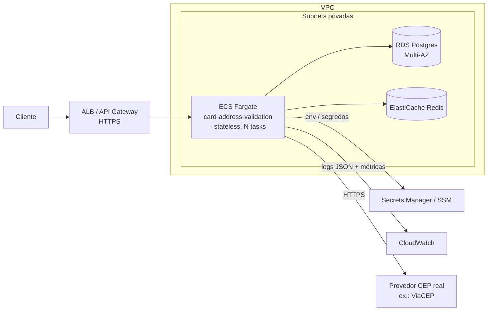

# ADR-0003: Deploy em AWS com ECS Fargate + RDS Postgres + ElastiCache Redis

- **Status:** aceita — arquitetura-alvo de produção; implementação (IaC/pipeline) em execução
- **Data:** 2026-07-01
- **Relacionada:** [ADR-0001](ADR-0001-arquitetura.md) (deixou a topologia de deploy explicitamente para um ADR próprio)

## Resumo (Y-statement)

No contexto do deploy em produção, diante da necessidade de rodar o serviço com
Postgres e Redis gerenciados e config por ambiente, decidimos por uma topologia
AWS baseada em **ECS Fargate + RDS Postgres + ElastiCache Redis**, aceitando o
custo de operar infraestrutura gerenciada, para obter escala horizontal stateless,
resiliência de dados (Multi-AZ) e config/segredos externalizados sem tocar o núcleo.

## Contexto

A aplicação já foi construída 12-factor: toda config vem do ambiente, é stateless
(estado vive em Postgres e Redis), e as fronteiras externas estão atrás de _seams_
(DataSource, CacheManager, porta do provedor). Isso torna o mapeamento pra serviços
gerenciados direto — a migração é de configuração e empacotamento, não de código.

## Decisão — topologia-alvo

Mapeamento 1:1 com o que já existe no código:

| Peça da app | Serviço AWS | Por que encaixa sem mudar o núcleo |
|---|---|---|
| App Spring Boot (stateless) | **ECS Fargate** | 12-factor; escala horizontal por tasks; sem gerenciar VM |
| Postgres (auditoria) | **RDS Postgres Multi-AZ** | mesmo driver; só muda a `DB_URL` (env) |
| Redis (cache) | **ElastiCache Redis** | atrás do `CacheManager`; troca o backend, não o service |
| Config / segredos | **Secrets Manager / SSM** | já é tudo `${VAR}`; nada hardcoded |
| Log estruturado JSON | **CloudWatch Logs** | profile `prod` já emite JSON logstash |
| Métricas (Micrometer) | **CloudWatch / Prometheus** | fachada neutra; só troca o registry exportador |
| Entrada HTTP | **ALB** (ou API Gateway) | TLS, health check em `/actuator/health` |

## Plano de implementação

1. **Imagem:** build da imagem do container e push pro **ECR** (a partir do CI).
2. **IaC:** provisionar VPC, subnets/SGs, RDS, ElastiCache, ALB e o serviço ECS via
   **Terraform** (ou CDK).
3. **Config:** parâmetros e segredos no **Secrets Manager / SSM**, injetados como
   variáveis de ambiente na task definition (as mesmas `${VAR}` que a app já lê).
4. **Pipeline:** CI (build + testes) → push ECR → deploy ECS (rolling).
5. **Observabilidade:** log driver pro CloudWatch; health check do ALB no Actuator;
   alarmes de erro/latência no CloudWatch.

## Alternativas consideradas

- **EKS (Kubernetes):** poder de sobra para um serviço só; custo operacional não se
  paga nesta fase. Fargate entrega o mesmo _stateless scaling_ com menos cerimônia.
- **Lambda + API Gateway:** atraente pelo custo ocioso, mas cold start e conexões
  persistentes (pool JDBC, Redis) atritam com o modelo serverless; a app já é um
  container pronto para Fargate.
- **EC2 auto-gerenciado:** joga fora o ganho de serviço gerenciado; mais patch e
  operação.

## Consequências

- **Positivas:** a migração não exige mudança no núcleo — só variáveis de ambiente
  e um pipeline de imagem. Multi-AZ no RDS dá resiliência de dados; escala é por
  número de tasks.
- **Custo/risco:** passa a haver infraestrutura a operar (rede, RDS, ElastiCache,
  ALB) e um pipeline a manter; a implementação de IaC e dos alarmes é trabalho
  próprio, guiado por este ADR.
