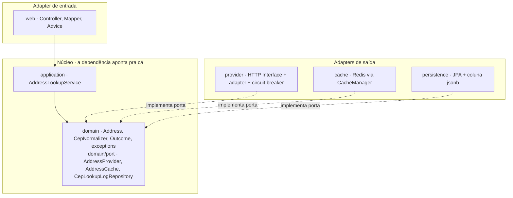
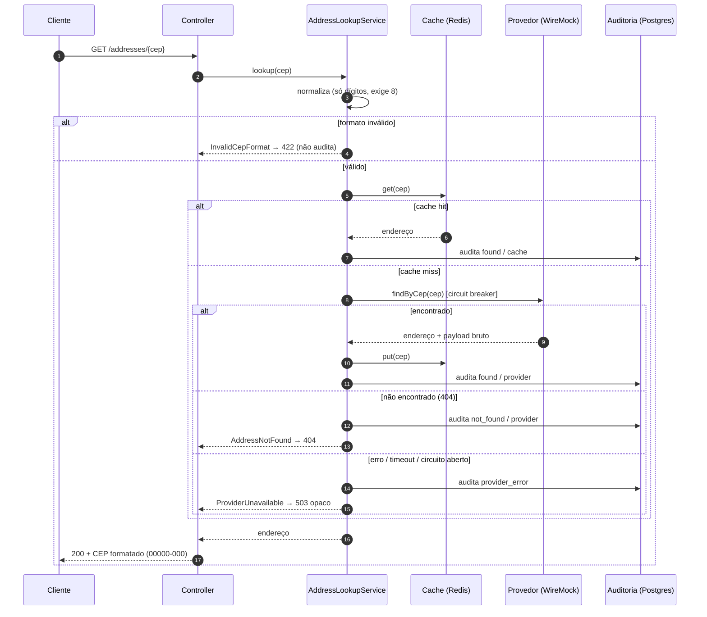

# Desenho de solução — card-address-validation

Serviço que, dado um CEP, consulta o endereço num provedor externo, **cacheia** o
resultado e **persiste um log de auditoria** de toda consulta (horário + retorno
cru do provedor). A moldura é o onboarding de cartão de um banco; o núcleo do
desafio é a consulta de CEP com log em banco.

As decisões de arquitetura estão nos ADRs ([ADR-0001](ADR-0001-arquitetura.md),
[ADR-0002](ADR-0002-observabilidade.md), [ADR-0003](ADR-0003-deploy-aws.md)) e o
comportamento na [Spec](spec-validacao-cep.md). Este documento é a visão de topo.

## 1. Componentes (visão de contêineres)

```mermaid
flowchart LR
  Client[Cliente HTTP<br/>Postman / curl]
  subgraph App[card-address-validation · Spring Boot]
    direction TB
    Web[Borda HTTP<br/>Controller + Advice]
    UC[Aplicação<br/>AddressLookupService]
    Prov[Adapter Provedor<br/>HTTP Interface]
    Cache[Adapter Cache]
    Pers[Adapter Persistência]
    Web --> UC
    UC --> Prov
    UC --> Cache
    UC --> Pers
  end
  Client -->|GET /addresses/&#123;cep&#125;| Web
  Prov -->|GET /ws/&#123;cep&#125;/json| WM[(WireMock<br/>provedor CEP mock)]
  Cache <-->|get / put · TTL| Redis[(Redis)]
  Pers -->|INSERT auditoria · jsonb| PG[(Postgres)]
```

Postgres, Redis e o mock do provedor sobem juntos via Docker Compose; o mesmo
mock (WireMock) serve o runtime.

## 2. Camadas (ports & adapters "light")

A regra da dependência aponta **pra dentro**: adapters dependem do núcleo; o
núcleo não conhece adapter nenhum. As fronteiras externas (provedor, cache,
persistência) ficam atrás de **portas** que o domínio define e os adapters
implementam — é o que torna o caso de uso testável contra dublês e permite trocar
o backend (mock↔API real, Redis↔serviço gerenciado) sem tocar no núcleo.

Cada camada tem **uma só razão pra mudar**: controller = HTTP, aplicação =
orquestração, adapter = integração, repositório = persistência.

## 3. Fluxo de uma consulta

## 4. Modelo de dados

Tabela `cep_lookup_log` (append-only):

| Coluna | Tipo | Papel |
|---|---|---|
| `id` | serial | identidade da linha |
| `cep` | varchar(8) | CEP canônico (só dígitos) |
| `queried_at` | timestamp | **horário da consulta** (requisito do desafio) |
| `outcome` | varchar | `found` / `not_found` / `provider_error` |
| `source` | varchar | `provider` / `cache` |
| `response_payload` | **`jsonb`** | **retorno cru do provedor** verbatim (nulo quando não há corpo) |

O `jsonb` guarda o payload semiestruturado sem exigir um segundo banco. Guardar o
retorno **cru** (não uma re-serialização do subconjunto mapeado) preserva
fidelidade ao que o provedor respondeu — é o requisito de auditoria do desafio.

## 5. Resiliência e observabilidade

- **Circuit breaker** (Resilience4j) na chamada ao provedor: uma indisponibilidade
  do provedor falha rápido em vez de travar threads; só falha de infra conta (um
  CEP inexistente **não** abre o circuito). Ver [ADR-0001](ADR-0001-arquitetura.md).
- **Cache é otimização, não a verdade:** indisponibilidade do cache vira _miss_ e
  a consulta segue pro provedor.
- **Resposta opaca** em falha do provedor: nenhum nome de provedor, causa ou stack
  vaza pro cliente; o detalhe fica no log interno.
- **Observabilidade** ([ADR-0002](ADR-0002-observabilidade.md)): Actuator +
  Micrometer (consultas por desfecho, latência do provedor, hit/miss do cache,
  estado do circuit breaker) + log estruturado JSON **em produção**; em dev o log
  é o console legível do Spring.

## 6. Deploy (AWS)

A produção roda em **AWS** — ECS Fargate + RDS Postgres + ElastiCache Redis —
detalhada no [ADR-0003](ADR-0003-deploy-aws.md). Os _seams_ já abstraídos
(DataSource, CacheManager, porta do provedor) fazem essa migração ser de
configuração e empacotamento, não de código: o núcleo não muda.
